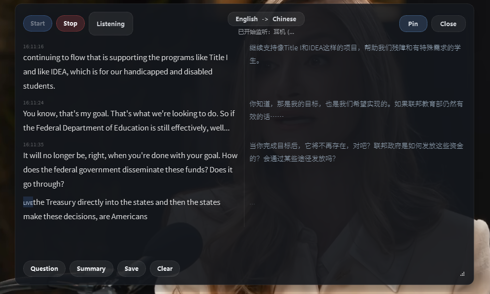

# Meeting Copilot

Windows 实时会议字幕工具 — 本地语音识别 + 中文翻译。

抓取系统音频（Teams / Zoom / Google Meet 等），用本地 Whisper 模型实时转写英文，再通过 OpenAI API 翻译成中文，以左右双栏悬浮窗显示。



## 功能

- **本地语音识别** — 使用 [faster-whisper](https://github.com/SYSTRAN/faster-whisper) 在本地 GPU 上运行，零网络延迟，逐词实时显示
- **中文翻译** — 句子完成后通过 OpenAI API 自动翻译，左右双栏对照显示
- **系统音频采集** — 通过 WASAPI loopback 捕获系统播放的音频，无需额外虚拟音频设备
- **悬浮窗** — 始终置顶的半透明窗口，可拖动、可调整大小，开会时放在屏幕边缘
- **会议助手** — 一键生成会议摘要、行动项和建议追问
- **保存记录** — 导出完整的双语会议记录为 Markdown 文件

## 系统要求

- Windows 10/11
- Python 3.10+
- NVIDIA GPU（推荐，用于 Whisper 加速；无 GPU 也可用 CPU 模式）
- OpenAI API Key（用于翻译和会议摘要）

## 安装

```powershell
# 克隆仓库
git clone https://github.com/YOUR_USERNAME/meeting-copilot-win.git
cd meeting-copilot-win

# 创建虚拟环境并安装依赖
python -m venv .venv
.\.venv\Scripts\activate
pip install -r requirements.txt

# 复制配置模板并填入 API Key
Copy-Item .env.example .env
# 编辑 .env，填入你的 OPENAI_API_KEY
```

> 首次运行时会自动从 Hugging Face 下载 Whisper 模型（large-v3 约 3GB），之后缓存在本地。

## 使用

```powershell
.\.venv\Scripts\activate
python main.py
```

1. 点击 **Start** 开始监听系统音频
2. 播放英文音频或加入会议
3. 左侧实时显示英文转写，右侧显示中文翻译
4. 点击 **Summary** 生成会议摘要，**Save** 保存记录

### 查看可用音频设备

```powershell
python main.py --list-devices
```

如果默认设备不对，在 `.env` 中设置 `LOOPBACK_DEVICE_INDEX=设备编号`。

## 配置

编辑 `.env` 文件：

| 变量 | 默认值 | 说明 |
|------|--------|------|
| `OPENAI_API_KEY` | *(必填)* | OpenAI API 密钥 |
| `WHISPER_MODEL_SIZE` | `large-v3` | Whisper 模型：`tiny` / `base` / `small` / `medium` / `large-v3` |
| `WHISPER_DEVICE` | `cuda` | 推理设备：`cuda`（GPU）或 `cpu` |
| `WHISPER_ENERGY_THRESHOLD` | `300` | 语音活动检测阈值，环境嘈杂时调高 |
| `TRANSLATION_MODEL` | `gpt-4.1-nano` | 翻译模型 |
| `SUMMARY_MODEL` | `gpt-5.4-mini` | 摘要模型 |
| `SOURCE_LANGUAGE` | `en` | 音频语言 |
| `TARGET_LANGUAGE` | `zh-CN` | 翻译目标语言 |
| `LOOPBACK_DEVICE_INDEX` | *(自动)* | 指定音频采集设备编号 |
| `AUDIO_CHUNK_MS` | `120` | 音频缓冲区大小（ms） |

## 项目结构

```
main.py                         # 入口，CUDA DLL 路径设置
meeting_copilot/
  audio.py                      # WASAPI loopback 音频采集
  whisper_engine.py              # 本地 Whisper 流式语音识别引擎
  controller.py                  # 业务逻辑：音频 → 识别 → 翻译
  llm.py                         # OpenAI API 翻译和摘要服务
  models.py                      # 数据模型
  config.py                      # 配置加载
  ui.py                          # PySide6 桌面 UI
```

## 架构

```
系统音频 (WASAPI loopback)
    ↓
音频采集线程 (16kHz mono PCM)
    ↓
Whisper 处理线程 (本地 GPU)
    ├→ 每 300ms 输出 partial → 左栏实时英文 [LIVE]
    └→ 静默检测后输出 final → 左栏确认英文
                                    ↓
                            OpenAI 翻译 API
                                    ↓
                              右栏中文翻译
```

## 许可

MIT
